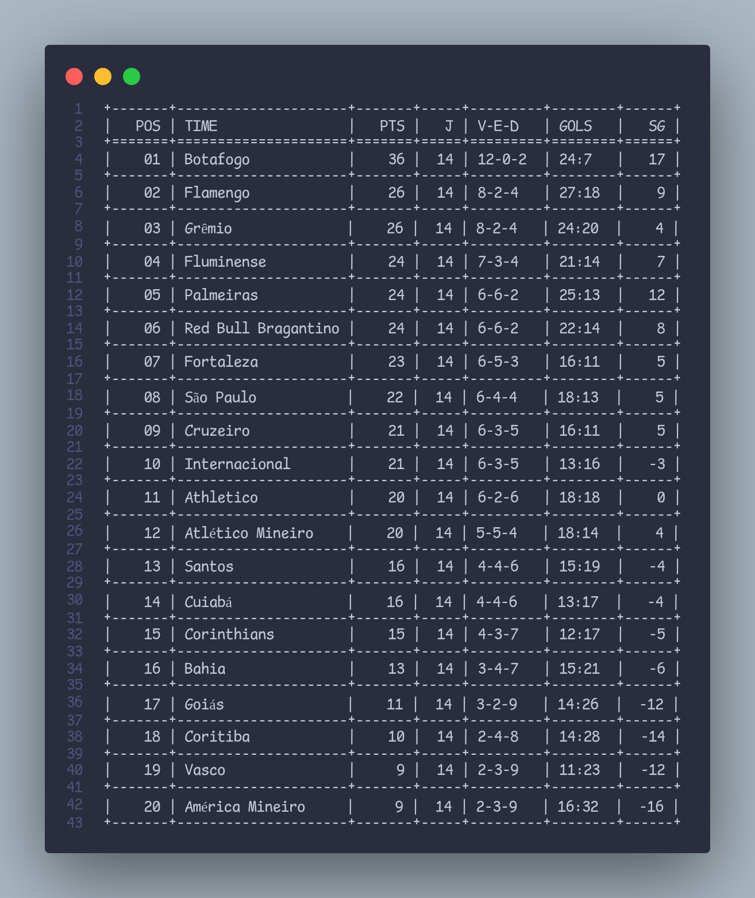

# formatar-tabela-futebol-python
Exemplo de como formatar tabela de campeonato usando Python

# Tabela de Liga de Futebol

Esta função em Python permite formatar uma tabela de liga de futebol usando o módulo `tabulate`. Ela recebe um objeto JSON com os dados da liga e retorna a tabela formatada.

## Instalação

Certifique-se de ter o Python 3 instalado. Use o seguinte comando para instalar o módulo `tabulate`:

## Adaptação
Caso queira alterar o formato dos dados da tabela lembre-se de editar a função 

## Exemplo saida

